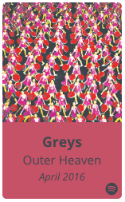

# Music Card

Version: 0.8

## Info

Place a Spotify reference to an album or track in a markdown file and it will beautifully pull in the necessary data.

*NOTE*: The play button links to Spotify, it does not play the track/album on the page.

This uses [jwilsson's Spotify Web API PHP library](https://github.com/jwilsson/spotify-web-api-php
) to interface with the Spotify API, and [Lokesh's Color Thief](https://github.com/lokesh/color-thief/) to retrieve colors from the album artwork.

The plan is to eventually support MusicBrainz links for albums that aren't on Spotify.

### Usage:

Album:

```markdown

```




Track:

```markdown

```


## Installation

1. [Create a Spotify Application](https://developer.spotify.com/my-applications).

1. Install [jwilsson's Spotify Web API PHP library](https://github.com/jwilsson/spotify-web-api-php
). [Using Composer](http://jwilsson.github.io/spotify-web-api-php/) is the recommended installation method.

2. Copy this whole directory to your user/plugins directory.

3. Edit line 131 in classes/MusicCard.php and add in your Client ID, Client Secret, and Redirect URI from your Spotify Application.

    ```php
    $session = new \SpotifyWebAPI\Session('CLIENT_ID', 'CLIENT_SECRET', 'REDIRECT_URI');
    ```

## TODO: 

- Move client authorization ID, secret, and callback URI to the blueprint so that it can be edited in the Admin plugin

Thanks to the Grav Team for writing the [MediaEmbed plugin](https://github.com/sommerregen/grav-plugin-mediaembed). I used this as a template to get things running at first.
