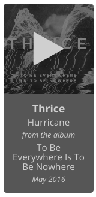

# Music Card - SoundCloud

## Info

Place a Spotify or SoundCloud reference to an album or track in a markdown file and it will beautifully pull in the necessary data.

*NOTE*: The play button links to Spotify, it does not play the track/album on the page.

This uses [jwilsson's Spotify Web API PHP library](https://github.com/jwilsson/spotify-web-api-php
) to interface with the Spotify API, [mptre's PHP SoundCloud library](https://github.com/mptre/php-soundcloud) to interface with the SoundCloud API, and [Lokesh's Color Thief](https://github.com/lokesh/color-thief/) to retrieve colors from the album artwork.

The plan is to eventually support MusicBrainz links for albums that aren't on Spotify.

### Usage:

Spotify Album:

```markdown

```


Spotify Track:

```markdown

```





SoundCloud Track:

*Currently, this needs to be a URI link. This link can be found in the embed code for the iframe. This will be changing in the near future.*

```markdown

```


## Installation

1. [Create a Spotify Application](https://developer.spotify.com/my-applications).

2. Copy this whole directory to your user/plugins directory.

3. In the plugins settings, fill in the Client ID, Client Secret, and Redirect URI from your Spotify Application.
    
### Thanks

Thanks to the Grav Team for writing the [MediaEmbed plugin](https://github.com/sommerregen/grav-plugin-mediaembed). I used this as a template to get things running at first.
